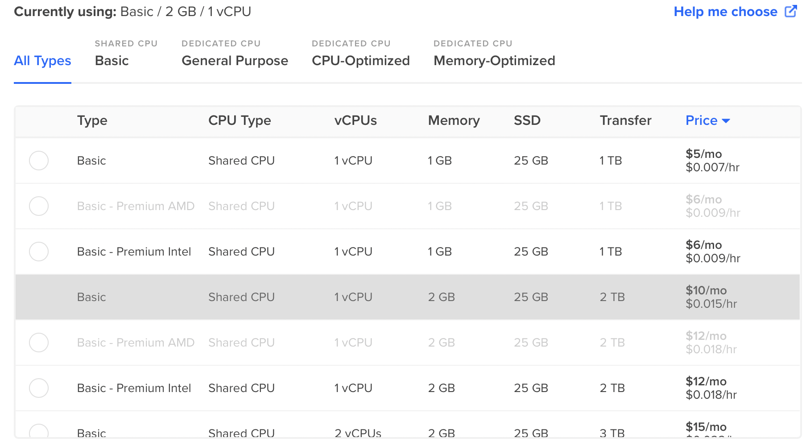

In the last two years I have slowly deviated from using GUI-interfaces for statistical analysis towards a more open and transparent approach. Before and during the pandemic I have shiftet my data-analysis completely to R and I have offered in the last semester for the first time a course on "Data Science in Education" in which I have used R intensively with students. Since my usage of R has increased in the meantime also towards more complex scenarios like natural-language-processing or social-network-analysis I was loooking into an analysis environment that is easy to reach and that can run without disturbing my other tasks. This requirement has become even more important during the pandemic in which I hardly find time to let my computer run 1 hour for an analysis without interacting. My usage scenario is clearly only a fraction of any standard high-performance-computing so I was looking for a flexible solution which is cheap and scalable.

#### Cloud computing and elastic hosting combined

In the end I have found a solution which combines a pre-configured version of the R-Studio-Server with a very flexible and easy hosting provider. In this short summary, i will describe how you can set up your own analysis environment in the cloud.

1. First of all, you need an account with the [hosting provider Digitalocean](https://m.do.co/c/163517ef0048). If you follow the referral link you will receive a credit of $100 over 60 days. This means effectively that your experimentation will not even cost you a dime. If you hesitate to start an account with a company based in the US, I can point you the the very [extensive information about adherence to GDPR rules](https://www.digitalocean.com/legal/gdpr/). In addition, you can also decide to put your server into a European location (my server is in Frankfurt, Germany).
2. The second step is that you need to install a so called "Droplet" on your server. Virtualisation of servers has the big advantage that non-technical users get a readymade server package without the need to configure a lot of dependencies and update scripts on the commandline etc. You might have heard from Docker or VMWare which is also used to run for example two operating systems on one computer. The virtualization images with Digitalocean are called Droplets and there is a Droplet which exactly fulfilled my requirements.
3. [Mauricio “Pacha” Vargas](https://pacha.dev), a statistican from Chile, has [created a Droplet](https://marketplace.digitalocean.com/apps/rstudio) that has all ingredients to run a lot of analysis options in the cloud. His droplet contains besides R and RStudio Server also the ShinyServer and a number of additional libraries and packages which should make the image relative future-proof. You can find a detailed step-by-step explanation how you can install the droplet and also add users to the Droplet on the Droplet page. You can even add multiple users and use the image in a research team.
4. The nice thing with the installation of the Droplet on the Digitalocean infrastructure is that you can at all times resize your Droplet and increase CPU capacity or memory. This comes of course with a price, but since you can also resize the Droplet back to the smallest image after a heavy operation (the basic image costs 5 US$ per month), the costs involved will be very limited. In my case, I was running into some memory problem during the collection of around 700 000 tweets and I resized the image just for this operation.

Your R-Server is after installation available under a unique IP and you can access it with a username and password. I am very satisfied with this solution and now I can start something on the server and come back after some time to continue analysis. I have not realised any delays due to the server-based access so far and it feels like I would be running R-Studio on my machine.

It would be nice if in the future a real multi-user access would be possible in which collaborative spaces could be defined on a project-basis without allowing access to all data in the environment. This would also make the cloud-environment an ideal environment for teaching statistics and data-science with R.